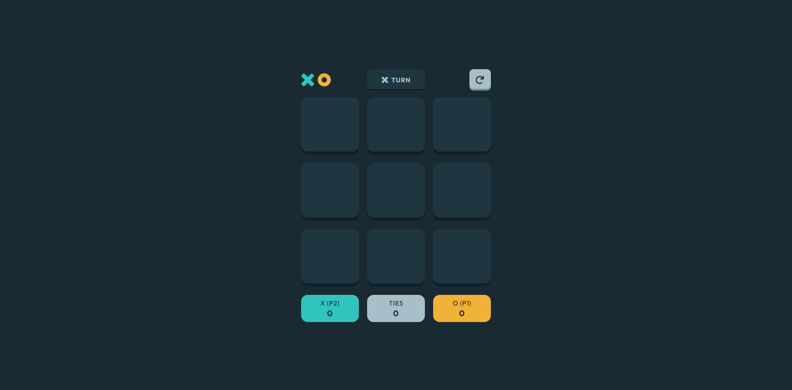

# Frontend Mentor - Tic Tac Toe solution

This is a solution to the [Tic Tac Toe challenge on Frontend Mentor](https://www.frontendmentor.io/challenges/tic-tac-toe-game-Re7ZF_E2v).

## Table of contents

- [Overview](#overview)
  - [The challenge](#the-challenge)
  - [Screenshot](#screenshot)
  - [Links](#links)
- [My process](#my-process)
  - [Built with](#built-with)
  - [What I learned](#what-i-learned)
  - [Continued development](#continued-development)
- [Acknowledgments](#acknowledgments)

## Overview

### The challenge

Users should be able to:

- View the optimal layout for the game depending on their device's screen size
- See hover states for all interactive elements on the page
- Play the game either solo vs the computer or multiplayer against another person
- Save the game state in the browser so that it’s preserved if the player refreshes their browser

### Screenshot

### Links

- Solution URL: https://github.com/pigfyy/Tic-Tac-Toe
- Live Site URL: https://pigfys-tic-tac-toe.netlify.app/

## My process

### Built with

- Tailwind CSS
- Mobile-first workflow
- [React](https://reactjs.org/) - JS library
- [Zustand](https://zustand-demo.pmnd.rs/) - State management website

### What I learned

Something important I learned during the building of the project is Zustand. Whilst I'm not entirely confident yet with the correct usage of the library, I've learned a lot during the building of this project.

### Continued development

I want to work on cleaner state management in my future projects. I'd also like to add smarter CPU moves eventually.

## Acknowledgments

Thanks to my mom for helping to review and look at the project to give suggestions.
